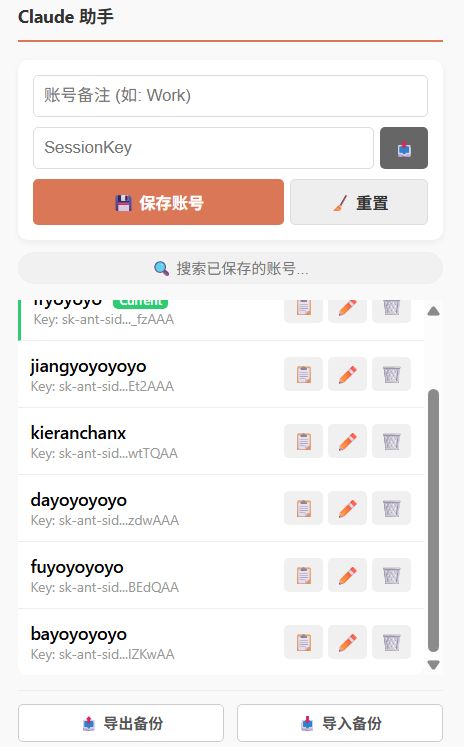

# Claude Account Switcher 🚀

**[🇺🇸 English](README.md) | [🇨🇳 中文文档](README_ZH.md)**

A lightweight, efficient Chrome Extension designed to manage and switch between multiple [Claude.ai](https://claude.ai) accounts seamlessly. Built with **Manifest V3**, **Modern UI**, and optimized vanilla JavaScript for high performance.

## ✨ Features

* **⚡ One-Click Switching**: Instantly switch accounts without manually logging out and logging back in.
* **🚀 Extreme Performance**:
    * **Debounced Search**: Smooth filtering experience even with large lists.
    * **O(1) Lookups**: Instant duplicate checks using Hash Maps.
    * **Zero Idle CPU**: Event-driven architecture ensures 0% CPU usage when not in use.
* **🚪 Quick Login**: Shortcut to clear session and return to login page.
* **🎨 Modern UI**: Clean, card-based design with SVG icons, **Dark Mode** support, and responsive layout.
* **📥 Smart Auto-Capture**: 
    * Automatically grabs the `sessionKey` from your current active tab.
    * **Username Extraction**: Automatically finds and fills your username directly from the Claude sidebar.
* **⏳ Limit Tracker**: 
    * **High-Perf Detection**: Uses `TreeWalker` and `MutationObserver` algorithms to precisely detect "limit reached" messages with minimal resource usage.
    * **Manual Timer**: Set custom cooldown timers for accounts.
* **🌍 Network Monitor**: 
    * Compact status bar showing **IP** and **Location**.
    * **One-Click Check**: Dedicated button to analyze IP risk score via external services.
* **✏️ Modal Editing**: Add or edit accounts in a focused, non-intrusive modal overlay.
* **✍️ Inline Editing**: Click the edit icon next to an account to edit its name directly in the list.
* **🖱️ Drag & Drop Sorting**: Organize your account list order simply by dragging items.
* **💾 Import & Export**: Backup your accounts to JSON.
* **🔒 Secure & Local**: 
    * Keys are stored in `chrome.storage.local`.
    * No remote servers.

## 🛠️ Tech Stack

* **Core**: HTML5, CSS3 (Variables & Flexbox), JavaScript (ES6+).
* **Architecture**: 
    * **Manifest V3**: Compliant with the latest Chrome security standards.
    * **High Performance**: No heavy frameworks, just pure, optimized code.
* **Algorithms**:
    * **TreeWalker**: For efficient DOM traversal.
    * **Debounce**: For input optimization.
    * **Hash Map**: For fast data retrieval.

## 📸 Preview

## 📦 Installation

This extension can be installed in two ways: by loading the source code directly (for developers) or by installing a pre-packaged file (for users).

**For a detailed, step-by-step guide for all user types, please see our [Installation Guide](install-guide.md) or the [中文安装指南](install-guide_ZH.md).**

### Quick Start for Developers

1.  **Clone or Download** this repository.
2.  Open Chrome and navigate to `chrome://extensions/`.
3.  Toggle **Developer mode** in the top right corner.
4.  Click **Load unpacked**.
5.  Select the project folder.

## 📖 Usage Guide

### 1. Adding an Account
1.  Click the **+** button.
2.  **Auto Method**: Log in to Claude.ai, open the modal, and click the **📥 button**.
3.  **Manual Method**: Paste your `sk-ant...` key into the input.
4.  Click **Save**.

### 2. Switching Accounts
* Simply click the **Name/Card** of any account in the list.
* The extension will update your cookies and reload the Claude tab instantly.

### 3. Network & Security
* **Check IP**: Look at the bottom status bar.
* **Security Report**: Click the **🔗** icon to view a fraud report.

## ⚠️ Security Note

* **Local Only**: Your data never leaves your browser.
* **Permissions**: 
    * `cookies`: To switch accounts.
    * `scripting`: To read your username from the page.
    * `storage`: To save your list.

## 📄 License

This project is licensed under the MIT License - see the [LICENSE](LICENSE) file for details.
